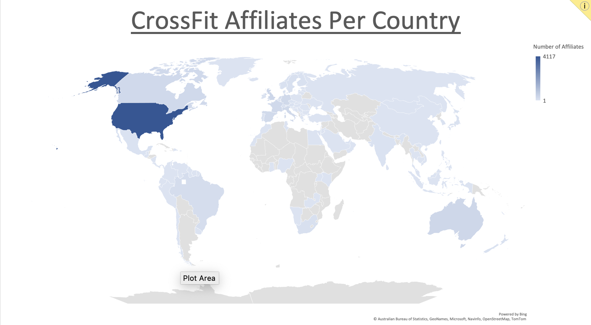
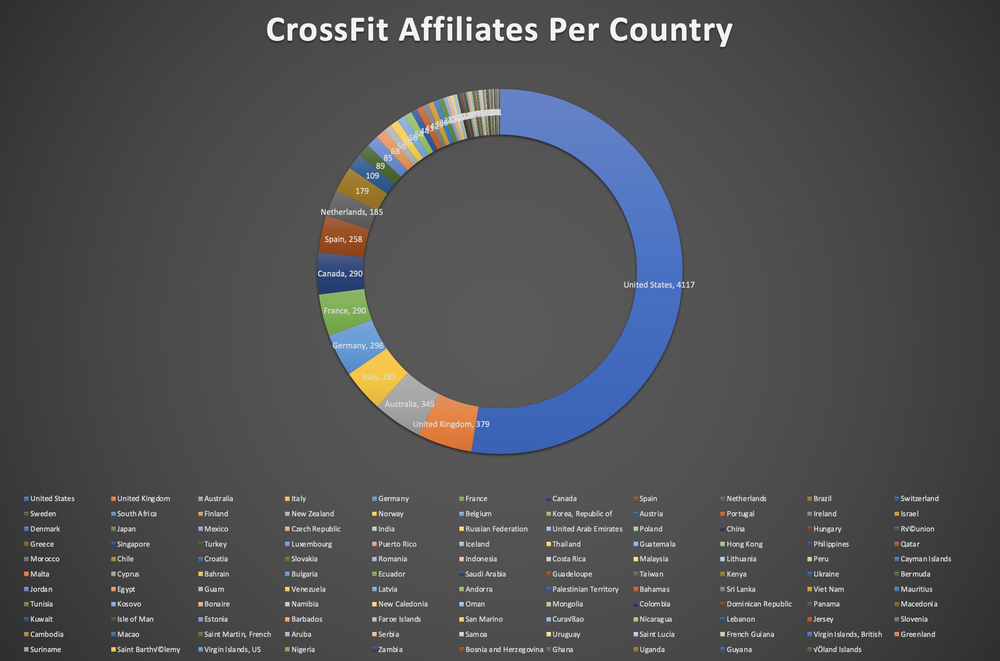
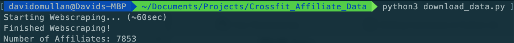
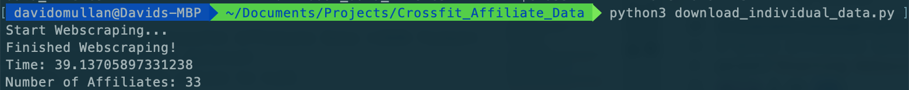
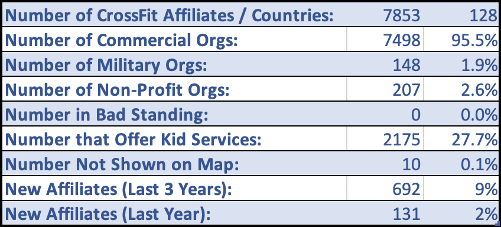
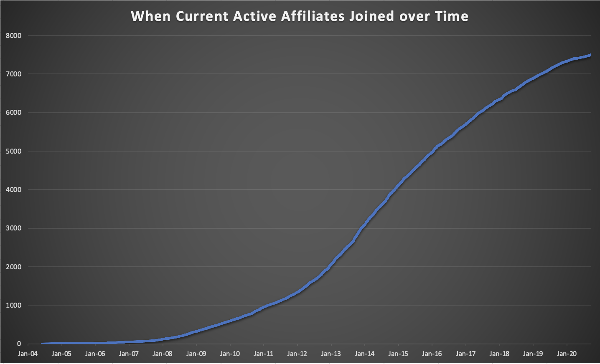

# CrossFit Affiliate Data
- Webscrape CrossFit.com for list of Affiliates and associated information

## Acknowledgments
- 'download_data.py' Developed by [David OMullan](https://github.com/davidomullan)
- 'download_individual_data.py' Developed by [David OMullan](https://github.com/davidomullan)
- 'world_map.png' Powered by Bing
- Affiliate data from https://www.crossfit.com (CrossFit, LLC)

## Software
Developed with [Python 3.9.13] (https://www.python.org/download/releases/3.0/)

## Execution
1. Open command line interface (i.e. Terminal for MacOS, Command Prompt for Windows)
2. Type 'python3 download_data.py', and press enter or return.
3. Wait for data to save in 'data_file.csv'

## Execution
1. Open command line interface (i.e. Terminal for MacOS, Command Prompt for Windows)
2. Type 'python3 download_individual_data.py', and press enter or return.
3. Wait for data to save in 'individual_data_file.csv'

